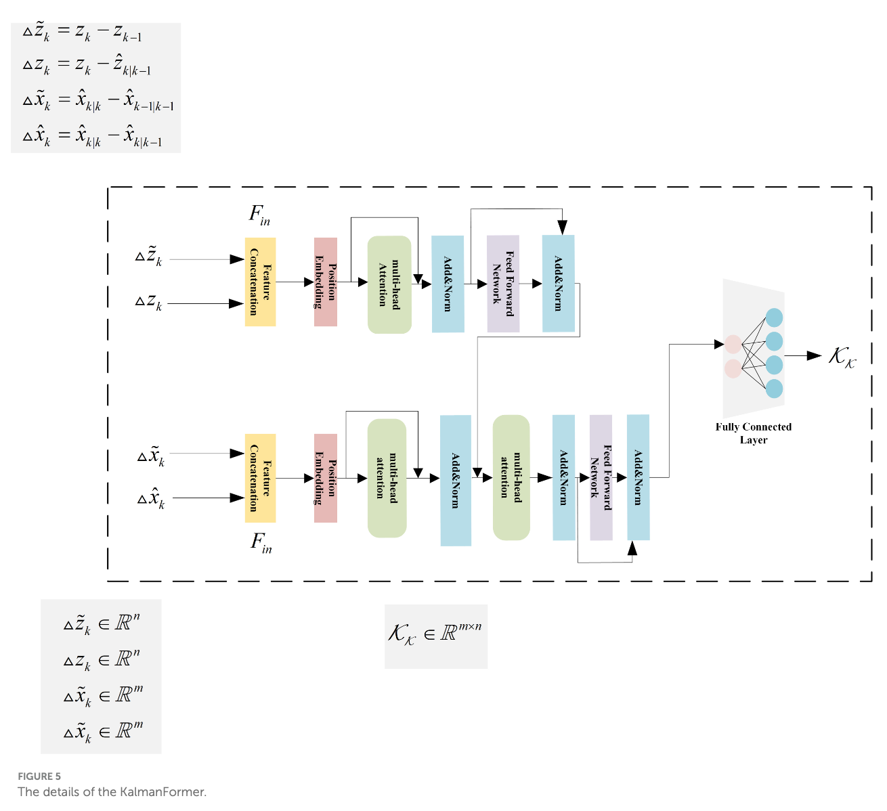

</img>

## KalmanFormer

Implementation of <a href="https://www.frontiersin.org/articles/10.3389/fnbot.2024.1460255/full">KalmanFormer</a>.

The paper proposes learning the Kalman Gain directly from data using Transformers, bypassing the limitations of traditional Kalman Filters on non-linear systems.

## Install

```bash
$ pip install kalmanformer
```

## Usage

```python
import torch
from kalmanformer import KalmanFormer

# kalmanformer

kalmanformer = KalmanFormer(
    state_dim = 3,
    obs_dim = 3,
    dim = 64,
    depth = 2,
    heads = 2,
    dim_head = 32,
    mlp_dim = 64
)

# mock observations

observations = torch.randn(2, 10, 3)

# state transition matrix f and observation matrix h

F = torch.randn(3, 3)
H = torch.randn(3, 3)

# initial state

x_0 = torch.zeros(2, 3)

# tracking over sequence

post_states = kalmanformer(
    observations,
    F,
    H,
    x_0 = x_0
)

assert post_states.shape == (2, 10, 3)
```

## Citations

```bibtex
@article{Shen2025KalmanFormer,
    title   = {KalmanFormer: using transformer to model the Kalman Gain in Kalman Filters},
    author  = {Siyuan Shen and Jichen Chen and Guanfeng Yu and Zhengjun Zhai and Pujie Han},
    journal = {Frontiers in Neurorobotics},
    year    = {2025},
    volume  = {18},
    doi     = {10.3389/fnbot.2024.1460255}
}
```
